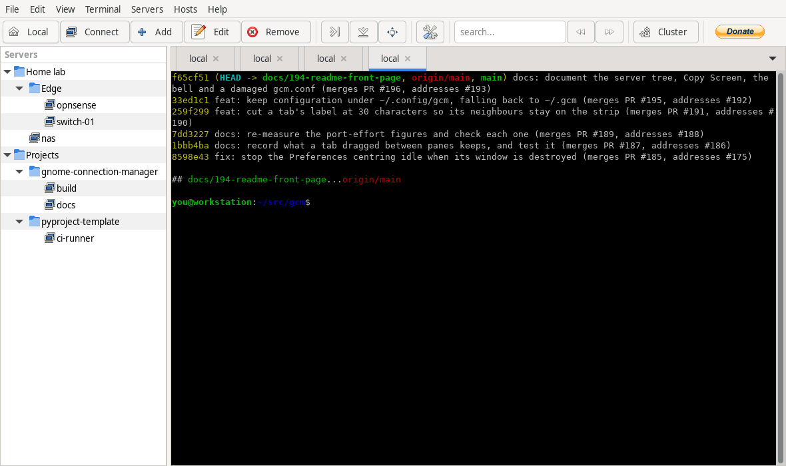

# Gnome Connection Manager (GCM)

A tabbed SSH, telnet and local-shell manager for GTK 3 desktops. Keep your hosts in a
folder tree, open them in tabs and split panes, and get sensible terminal behaviour —
copy and paste that does not fight you, session logging, and shortcuts you can change.



Requires Python 3.12+ and GTK 3.

---

## What it does

**Connections**

- SSH, Telnet and local shell sessions, each in a tab, with horizontal and vertical splits
- Passwords stored encrypted, plus private keys, SSH agent forwarding, X11 forwarding,
  compression and a keep-alive interval
- Port forwarding per host: local forwards and dynamic (SOCKS) forwards, several at a time
- Cluster mode: type once and send it to every console you have selected
- Commands sent automatically after login, with a delay syntax, and a checkbox that turns
  them off without discarding them

**Organising hosts**

- A folder tree you can nest as deep as you like, rearranged by dragging, or sorted back
  to name order one folder at a time
- Per-host terminal type, colours, and backspace/delete behaviour
- Import and export the whole list, encrypted with a password you choose

**Terminals**

- Session logs per host, laid out to mirror your folder tree; optional raw recording that
  replays as a readable transcript
- A searchable buffer viewer, in colour, for reading scrollback without the mouse
- Copy and paste that does not clobber the clipboard, with optional OSC 52 so a program on
  the far end can set it
- `Ctrl+click` a `file:line` in output to open it in your editor
- Drop files on a terminal to insert shell-quoted paths
- Per-terminal font zoom, and tab labels that follow the program's title
- A tab you are not watching is marked when its output stops, when it rings the bell, or
  when its session ends, so an agent CLI working in another tab shows when it is done
- Every shortcut configurable, plus custom byte sequences bound to keys of your choice

---

## Documentation

- [Using terminals in GCM](docs/TERMINAL-USAGE.md) — selection when an application has
  taken the mouse, what Copy All copies, pasting, session recording and transcripts, OSC 52,
  the buffer viewer, tab titles, tabs that need your attention, font zoom, the shortcut
  table, and what GCM does with a `gcm.conf` it cannot read
- [Hosts and folders in GCM](docs/HOSTS-AND-FOLDERS.md) — the server tree: making and moving
  folders, putting it in the order you want, and what export and import carry
- [Developing](docs/DEVELOPING.md) and [Project structure](docs/PROJECT_STRUCTURE.md) — how
  to set up an environment, and what lives where
- [Architecture decisions](docs/decisions/) — the records behind host ids and the folder tree
- [Specification](docs/SPEC.md) — a statement of behaviour, written as a spec for a Qt 6
  port that is **not** being built. Its own §14 measures the port and concludes against it,
  so read the behaviour and ignore the framework

---

## Installation

No pre-built packages are published yet, so build from source.

### 1. Install build tools

```bash
sudo apt install git ruby ruby-dev build-essential gettext python3-pip -y
sudo gem install fpm
```

### 2. Clone and build

```bash
git clone <this repository>
cd gnome-connection-manager
make deb
```

`make deb` prints the name of the package it wrote to the current directory.

### 3. Install

```bash
sudo apt install ./gnome-connection-manager_*_all.deb
```

### Runtime dependencies (resolved automatically by apt)

| Package | Purpose |
|---|---|
| `python3` | Python 3 runtime |
| `python3-gi` | GTK 3 Python bindings |
| `python3-gi-cairo` | Cairo integration |
| `gir1.2-gtk-3.0` | GTK 3 typelib |
| `gir1.2-vte-2.91` | VTE terminal widget |
| `python3-pyaes` | AES encryption for stored passwords |
| `expect` | SSH password injection |

---

## Configuration

GCM stores its configuration in `~/.config/gcm/gcm.conf`, honouring `$XDG_CONFIG_HOME`
where that is set. An installation that already has `~/.gcm/` from an older version goes
on using it, in place — nothing is copied or moved, and moving the directory yourself is
all it takes to switch.

Preferences covers the settings. A few are edited in the file by hand — the `[keys]` block
has no dialog at all — and GCM writes `[options]` from memory whenever it saves, closing
the window included, so **edit the file with GCM closed** or your change will be written
over. [Using terminals in GCM](docs/TERMINAL-USAGE.md) gives each setting with its
Preferences control, and says what GCM does with a file it cannot read.

### Language

GCM uses the system locale by default. To override:

```bash
LANG=en_US.UTF-8 gnome-connection-manager
```

### Logging

```bash
GCM_LOG_LEVEL=DEBUG gnome-connection-manager
```

The first line it prints names the configuration directory in use.

---

## Running from source

GCM uses [uv](https://github.com/astral-sh/uv) for dependency management and
[doit](https://pydoit.org/) as a task runner. doit is a dev dependency, so `uv sync`
installs it — there is nothing separate to install.

```bash
git clone <this repository>
cd gnome-connection-manager
uv venv --system-site-packages
uv sync --extra dev
doit launch
```

Day to day:

```bash
doit launch   # Launch the app
doit check    # Format, lint, typecheck, tests
doit test     # Run the pytest suite
doit list     # Every task
```

See [docs/DEVELOPING.md](docs/DEVELOPING.md) for the full development guide,
[docs/PROJECT_STRUCTURE.md](docs/PROJECT_STRUCTURE.md) for the layout and where the work
stands, and [.github/CONTRIBUTING.md](.github/CONTRIBUTING.md) for the issue-branch-PR
workflow.

---

## License

[GPLv3](https://www.gnu.org/licenses/gpl-3.0.html)
